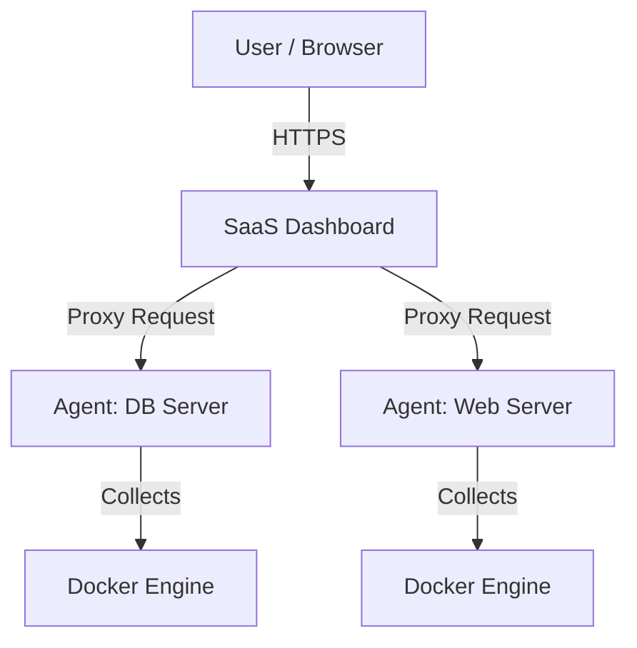

# Server Monitor - SaaS Ready 🚀

A modern, real-time server monitoring solution designed for SaaS deployments. Monitor multiple servers from a single, centralized dashboard with a lightweight, secure agent architecture.


## ✨ Features

- **Real-Time Monitoring**: Live CPU, RAM, Disk, and Network usage updates.
- **Multi-Server Support**: Monitor unlimited servers from one dashboard.
- **Lightweight Agent**: Low-overhead Go-based agent runs on any Linux server.
- **Secure Architecture**:
    - **Master API Key**: Protects dashboard access.
    - **Agent Tokens**: Unique, auto-generated keys for each monitored server.
    - **Proxy Mode**: Dashboard proxies requests to agents, keeping them secure behind firewalls.
- **One-Click Installation**: Simple `curl | bash` script to deploy agents instantly.
- **Docker Native**: Fully containerized for easy deployment.

## 🏗️ Architecture



> For detailed Docker build and publish instructions, see [DOCKER_GUIDE.md](DOCKER_GUIDE.md).

---

## 🚀 Quick Start (SaaS Deployment)

### 1. Deploy the Dashboard
Run the dashboard on your central VPS (e.g., DigitalOcean, AWS, Linode).

```bash
# Clone the repository
git clone https://github.com/avirooppal/ServerMonitor.git
cd ServerMonitor

# Start the Dashboard
docker-compose up -d --build
```

The dashboard will be available at `http://YOUR_VPS_IP:8082`.

### 2. Get Your Master Key
On the first run, a secure Master API Key is generated. Retrieve it:

```bash
docker exec server-moni-dashboard-1 cat data/api_key.txt
```

1. Check for Docker (and install if missing).
2. Pull and run the Agent container.
3. Output the **API Key** and **URL** for that agent.

### 5. Add to Dashboard
Copy the **Name**, **URL**, and **API Key** from the script output back into your Dashboard's "Add System" form.

---

### 3. Install Agents

#### Option 1: Single Command (Recommended)

Run the following command on your Linux server (requires `systemd`):

```bash
wget -qO- https://your-server-domain.com/setup.sh | sudo bash -s -- <API_URL> <API_TOKEN>
```

Replace `<API_URL>` with your Server Monitor backend URL (e.g., `https://monitor.example.com`) and `<API_TOKEN>` with your agent token.

#### Option 2: Docker

```bash
docker run -d \
  --name server-moni-agent \
  --restart unless-stopped \
  --network host \
  -v /var/run/docker.sock:/var/run/docker.sock \
  -e API_URL="https://monitor.example.com" \
  -e API_TOKEN="your-token" \
  avirooppal/linux-monitoring-agent:latest
```

---

## 🛠️ Local Development

To run the entire stack (Dashboard + Agent) locally on your machine:

1. **Start the Stack**:
   ```bash
   docker-compose up -d --build
   ```

2. **Access Dashboard**:
   - Open `http://localhost:8082`

3. **Connect Local Agent**:
   - The local agent is running on port `8081`.
   - In the Dashboard, add a system with:
     - **URL**: `http://agent:8080` (Internal Docker Network)
     - **API Key**: Retrieve from `docker exec server-moni-agent-1 cat data/api_key.txt`

---

## 🔧 Configuration

### Environment Variables

| Service | Variable | Description | Default |
|---------|----------|-------------|---------|
| **Dashboard** | `PORT` | Port to serve the UI/API | `8080` |
| **Agent** | `API_PORT` | Port for Agent API | `8080` |
| **Agent** | `COLLECTION_INTERVAL_SECONDS` | Metrics update frequency | `5` |

---

## 🤝 Contributing

Contributions are welcome! Please feel free to submit a Pull Request.

## 📝 License

MIT License. Free for personal and commercial use.
